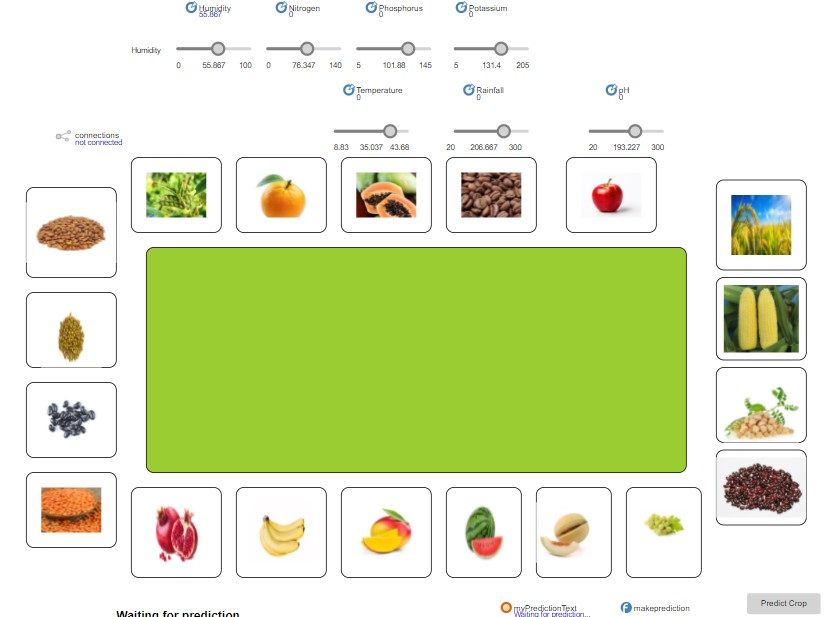
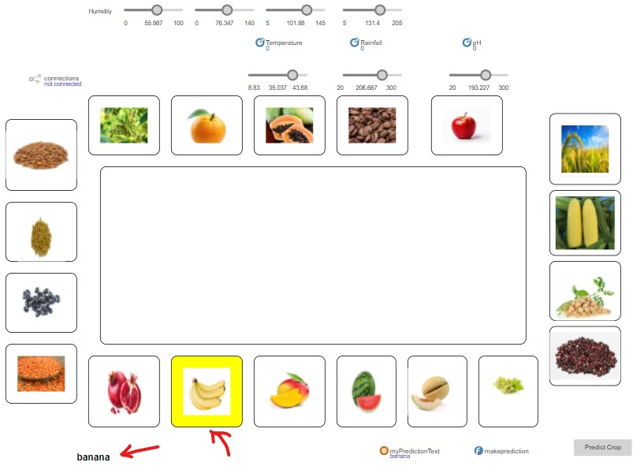

# Crop Prediction using Agent based modeling and Machine Learning

This repository contains the AnyLogic model for the project "Crop Prediction using Agent based modeling and Machine Learning". This model simulates the influence of weather factors on soil dynamics, utilizing the Crop_Prediction.csv dataset from Kaggle Dataset Repository to enhance our understanding of Crop Prediction based on the different environmental factors and soil quality.

# Crop Prediction Project

This repository contains two main components:
1. A **Machine Learning Model** for crop prediction.
2. An **AnyLogic Model** to simulate the prediction process.


---

## Table of Contents

1. [Prerequisites](#prerequisites)
2. [Cloning the Repository](#cloning-the-repository)
3. [Importing the Model in AnyLogic](#importing-the-model-in-anylogic)
4. [Running the Model](#running-the-model)
5. [Adjusting Parameters](#adjusting-parameters)
6. [Outputs](#outputs)
7. [Acknowledgments](#acknowledgments)

---

## Prerequisites

To open and run this model, you need:
- **AnyLogic Software**: Please install AnyLogic (version X.X or later) from [AnyLogic's official website](https://www.anylogic.com/).
- **Git** (optional): If you prefer cloning via command line.

### For the ML Model:
- **Python 3.7 or higher**
- **Flask (`pip install flask`)**
- **Other dependencies listed in `requirements.txt`**

---

## Cloning the Repository

To obtain a copy of this project, follow one of these methods:

### Method 1: Cloning via Git

If Git is installed, open a terminal and enter the following command:

```bash
git clone https://github.com/DEVANG-2021/CropPredictionModel.git
```
### Downloading the Repository

1. **Download as ZIP**:
   - Go to the repository’s GitHub page.
   - Click on **Code > Download ZIP**.
   
2. **Extract the ZIP**:
   - Unzip the downloaded file to a folder of your choice on your local machine.

---
## Running the ML Model
1. **Navigate to the ML_model folder**:
   
```bash
cd ML_model
```

2. **Navigate to the ML_model folder**:

```bash
  cd ML_model
```

3. **Start the Flask server**:
```bash
python api.py
```

4. The ML model will now run on the Flask-based API. You can interact with it through its endpoint.

## Importing the Model in AnyLogic

1. **Open AnyLogic**:
   - Start AnyLogic on your computer.

2. **Import the Project**:
   - In AnyLogic, go to **File > Open Project**.
   - Navigate to the folder where you extracted the ZIP file.
   - Select the `.alp` file (e.g., `CropPredictionNew.alp`) and click **Open**.

---

## Running the Model

1. **Select the Experiment**:
   - Locate the **Projects** pane (usually on the left side of the AnyLogic interface).
   - Select the main experiment, typically named `Main` or `Simulation`.

2. **Run the Experiment**:
   - Click the **Run** button (green triangle) in the AnyLogic toolbar, or right-click the experiment name and select **Run**.

3. **View the Simulation**:
   - The simulation window will open, displaying the Crop Prediction Main Agent with the button, sliders, and crop images.

### Example

Here’s an example screenshot of the simulation:






---

## Adjusting Parameters

You can modify certain weather and fire parameters to see how different conditions affect the simulation:

1. **Locate Parameters**:
   - In the **Projects** pane, click on the main experiment (`Simulation` or `Main`).
   
2. **Modify Values**:
   - Modify input parameters within the AnyLogic model to test different scenarios.
   - For the ML model, update the input data in the API payload to adjust predictions.

3. **Save and Run**:
   - After modifying parameters, save changes and **Run** the experiment again to see the effects.

---

## Outputs

The model provides several outputs, including:
- **ML Model**: Provides crop prediction results via the Flask API.
- **AnyLogic Model**: Simulates crop prediction dynamics and outputs visualization of scenarios.

---

## Acknowledgments

Special thanks to Dr. Ziad Kobti for his support and guidance.

**Technologies used**:
- **AnyLogic**: For simulation modeling.
- **Java**: For programming and model customization.
- **Python**: For programming and making machine learning model and also perform visualisation.

